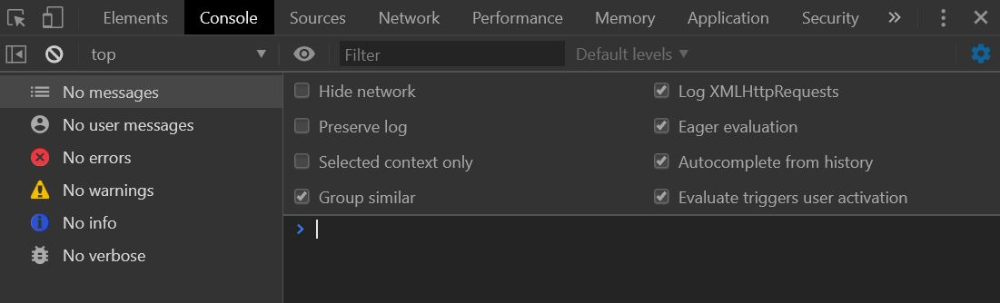
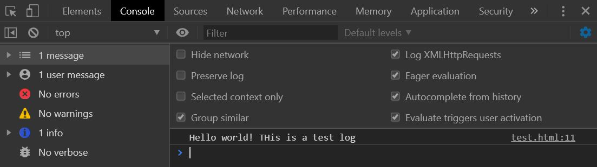

# Basic Javascript {#intro}


<center></center>
JavaScript, HTML, and CSS work together to create an interactive and beautiful web pages.

* **HTML** provides the basic structure of sites, which is enhanced and modified by other technologies like CSS and JavaScript.
* **JavaScript** is used to control the behavior of different elements.
* **CSS** is used to control presentation, formatting, and layout.


## What is JavaScript

JavaScript (JS/js) is a programming language that adds interactivity to your website (for example games, responses when buttons are pressed or data is entered in forms, dynamic styling, and  animation). Hence, JavaScript improves the user experience of the web page by converting it from a static page into an interactive one. JavaScript has also been used beyond the web development to create games, and web and mobile applications.


### Text editor and integrated development environment (IDE)

To create your HTML/js applications, you will have to use a text editor like [Atom](https://atom.io/), [VS Code](https://code.visualstudio.com/), [Brackets](http://brackets.io/) or [Sublime Text](https://www.sublimetext.com/) to write and develop your code. Another option is to use an IDE such as [JetBrains WebStorm](https://www.jetbrains.com/webstorm/). You can pick any one of these and learn the features these text editors or IDEs offer.


### The HTML skeleton

There's some basic code that (nearly) all HTML documents have in common. Here's a typical bare-bones HTML document.

```html
<!DOCTYPE html>
<html lang="en">

<head>
    <meta charset="UTF-8">
    <title>Your Title goes here!</title>
</head>

<body>

</body>

</html>

```

We will write our script in the `<body></body>` section. Hence we have to let HTML know that we are writing JavaScript:


```html
<body>
    <script>
        <!-- Our JavaScript goes in here -->
    </script>
</body>

```
In this code, I've cut off the head and html sections to make this chapter shorter. From this point foward, we will only be concerned with the code inside `<script></script>`.


### The console

The console in the browser is where you will see messages, errors, and logs of your code. Normally, it will detail what went wrong with your code if you did not get what you expected in the browser.

<center></center>


The `console.log()` is a function that writes a message to log on the debugging console. In a browser you will not see anything on the screen. It logs a message to a debugging console. It is normally used when need to test parts of your code.

```html
<script>
    console.log("Hello world! THis is a test log")
</script>

```

<center></center>


## var, and const

`var`, `let`, and `const` are three ways to define variables in JavaScript. We will not go through `let` as we will not be using it for most of this tutorial. If you want to know more about `let`, you can visit [here](https://www.w3schools.com/js/js_let.asp) to learn more.


### var

`var` is used to declare a variable. Variables are containers for storing information.


```javascript
var Name; // declare Name, but it is empty for now
Name = "John"; // Now, the variable Name contains John

var Name = "John"; // works the same way as above
```
You may want to create empty variables to store information later during loops.


### const

`const` variables cannot be reassigned once they are named.

```javascript
const PI = 3.141592653589793;
PI = 3.14;      // This will give an error
PI = PI + 10;   // This will also give an error
```
The keyword const is a little misleading. It does NOT define a constant value. It defines a constant reference to a value. Because of this, we cannot change constant primitive values, but we can change the properties of constant objects.


You can change the properties of a constant object:

```javascript
// You can create a const object:
const car = {type:"Fiat", model:"500", color:"white"};

// You can change a property:
car.color = "red";

// You can add a property:
car.owner = "Johnson";
```

But you can NOT reassign a constant object:

```javascript
const car = {type:"Fiat", model:"500", color:"white"};
car = {type:"Volvo", model:"EX60", color:"red"};    // ERROR
```

You also cannot re-declare your constants

```javascript
const x = 2;       // Allowed
const x = 3;       // Not allowed
x = 3;             // Not allowed
var x = 3;         // Not allowed
let x = 3;         // Not allowed
```

Hence, we normally use them as constants, like trial duration, number of trials

```javascript
const TRIAL_DURATION = 1000; // 1000 ms
const N_TRIALS = 90; // 90 trials
```

## Comments

You can comment out codes or write comments in two ways:

```javascript
// this is a one line comment
```

```javascript
/*
This is a multi-line comment
Hello world!
You can continue to type as usual here
*/
```

It is conventional to comment before the code section to aid others with understanding your thought process for that section of code. Everyone has a different coding style, hence comment your code!


## Arrays
An array is a variable that can hold more than one value at a time. Think about it like a column or a row in your excel spreadsheet. One row/column could be a variable.
For example, if you have three different types of cars, you can put them into an array!

```javascript
var cars = ["BMW", "Volvo", "Hyundai"];
```

The structure of an array is like this:

```javascript
var array_name = [item1, item2, ...];    
```

Hence, an array can hold many elements or values under a single name, and you can access its element by referring to its index, **starting from 0**.

```javascript
console.log(cars[0]) // returns BMW
```

You can also create an empty array by leaving the elements in the brackets blank:

```javascript
var counter = [];    
```

## Objects
A JavaScript object properties. For example, a car could be an object, and have properties such as make, model, year, weight, and color. An object is created using `{}` instead of `[]`. In the brackets, the object's properties can be defined.

```javascript
var car = {
  make: "BMW",
  model: "3 Series",
  year: "2020",
  weight: "1800kg",
  color: "White"
}
```

Notice that each property is written as name: value pairs, where name and value is separated by a colon.

You can also extract each property from the object!

```javascript
console.log(car.model) // returns "3 Series"
}
```

## Functions
A function is a set of code that is written as a block to perform a particular task. You can execute a function by calling it. So far, we have used the console.log() function, which logs the output in to the console.

The general structure of a function is defined by the `function` keyword, followed by a **user-defined name**, and then parenthesis **()**. The code that you want the function to execute are placed inside the curly brackets **{}**. This is how it looks like:

```javascript
function name(parameter1, parameter2, parameter3) {
  // code to be executed
}
```
Functions stop executing when it reaches a `return` statement where it will return the value in that `return` statement:

```javascript
function myaddition(v1, v2, v3) {
  var v_add = v1 + v2 + v3 // code to be executed
  return v_add // returns v_add when the function is executed outside here
}

console.log(myaddition(1, 2, 3)) // returns 6
```

Furthermore, functions often compute a **return value** which you want to compute at the end of the function. 

People create functions to reuse code and execute them without having to write the same lines of code over again. The only difference for these repeats are the arguments for the functions.


## Booleans and comparisons

Booleans represent one of two values: **true** or **false**

::: l-body-outset
| Operator    | Description          |
|-------------|----------------------|
| `&&`        | and                  |
| `||`        | or                   |
| `!`         | not                  |
:::


```javascript
var x = 5;
var y = 8

console.log(x > 3 && y > 5) // returns true
console.log(x > 8 || y > 6) // returns true
console.log(!(x > 8 || y > 6)) // returns false
```


Comparisons, on the other hand, are used in logical statements to determine equality or difference between variables ot values. If the statement is true, then the logical statements returns `true`, if not, it returns `false`.

::: l-body-outset
| Operator    | Description                          |
|-------------|--------------------------------------|
| `==`        | equal to                             |
| `===`       | equal value and equal type           |
| `!=`        | not equal to                         |
| `!==`       | not equal value or not equal type    |
| `>`         | more than                            |
| `<`         | less than                            |
| `>=`        | more than or equal to                |
| `<=`        | less than or equal to                |
:::


```javascript
var x = 5;

console.log(x == 5) // returns true
console.log(x == '5') // returns true
console.log(x === '5') // returns false
console.log(x > 8) // returns false
console.log(x < 8) // returns true
```


Here are some examples of comparison operators. You can check out this [site](https://www.w3schools.com/js/js_comparisons.asp) for more details


## Conditional statements

One reason to use comparisons and booleans is when you need to perform different actions based on certain conditions. For example, if the value of your object x is greater than a threshold, you might want your code to perform a set of lines. On the other hand, if the value is not greater (i.e., lesser) than the threshold, you might want your code to perform another set of lines.

In short, conditional statements are anchor points in decision making in your script. There are different conditional statements based on the type of anchor points.


### If, else, else if

`if`, `else`, and `else if` are variants of the `if` statement  

* Use `if` to specify a block of code to run only if the condition is true.
* Use `else` after if to specify a block of code to run if the condition in the if statemtent is false.
* Use `else if` to specify a new condition between `if` and `else`, much like comma.

A schematic could look like this:

```javascript
if (condition1) {
    //  block of code to be executed if the condition1 is true
} else if (condition2) {
    //  block of code to be executed if the condition2 is true
} else {
    //  block of code to be executed if the neither conditions are true
}
```

In an example, let's say my variable is `x = 5`. My first condition is whether x is < 4 (condition A). If it is, the output will be `x is < 4`. If not, I will it through condition 2: is x > 8? If it is, then the output will be `x is > 8`. If neither conditions are true, then the output will be `x is in between 4 and 8`.

```javascript
var x = 5;
if (x < 4) {
    console.log('x is < 4');
} else if (x > 8) {
    console.log('x is > 8');
} else {
    console.log('x is in between 4 and 8');
}
```


### Switch

Switch is similar to the `if`, `else`, and `else if` statement, but the difference is in switching between discrete cases.

```javascript
switch(expression) {
  case x:
    // code block
    break;
  case y:
    // code block
    break;
  default:
    // code block
}

```

If there is a match between the expression and case, the corresponding code block will be executed. If there is no match, then the default code block will be executed. The `break` keyword is used to break out of the loop once that line is executed so you will not be stuck in an infinite loop inside the code block for the case. 

Below is an example of using switch and case:

```javascript
var x = 0;

switch (x) {
  case 0:
    text = "This is the numeric zero";
    break;
  case 1:
    text = "This is the numeric one";
    break;
  default:
    text = "Any other number or character '0' or '1' ";
}

console.log(text)

```


## Conclusion

This is only an introduction to some of the basic javascript you will need in order to start tinkering with jsPsych. If you wish to learn more about JavaScript in greater detail, click [here](https://www.w3schools.com/js)! There are tons of examples you can follow through and play around to get the hang of it. This page is also developed based on some of the examples from the link above.
